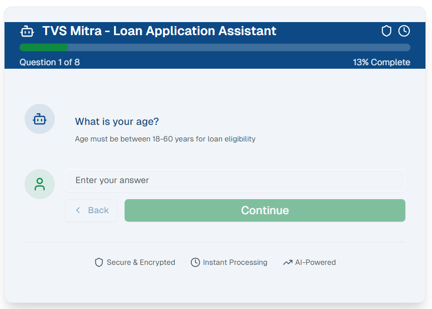

## TW Loan Acquisition Chatbot PART 2

### TVS Mitra Chatbot

Built a customer-friendly chatbot taking minimum questions from users, processes using ML pipeline and provides an instant loan eligibility decision (approve/decline).

It further integrating the conversational UI with a personalized recommendation layer, where instead of rejecting a customer outright for the specific model, it evaluates all models under the given Make_Code and returns the list of approved/eligible options for the user.

This approach softens the impact of rejection, gives user multiple financing choices instantly, improves satisfaction & increases likelihood of conversion.

### Detailed Overview

   - Chatbot is live at: **[tvs-mitra-chatbot.vercel.app](tvs-mitra-chatbot.vercel.app)**

   - Project is live at: **[https://vercel.com/nikitarstudy-4431s-projects/tvs-mitra-chatbot](https://vercel.com/nikitarstudy-4431s-projects/tvs-mitra-chatbot)**
   - Any changes you make to your deployed app will be automatically pushed to this repository from [v0.app](https://v0.app).

### Steps to Deployment

1. Create and modify your project using [v0.app](https://v0.app)
2. Deploy your chats from the v0 interface
3. Changes are automatically pushed to this repository
4. Vercel deploys the latest version from this repository
